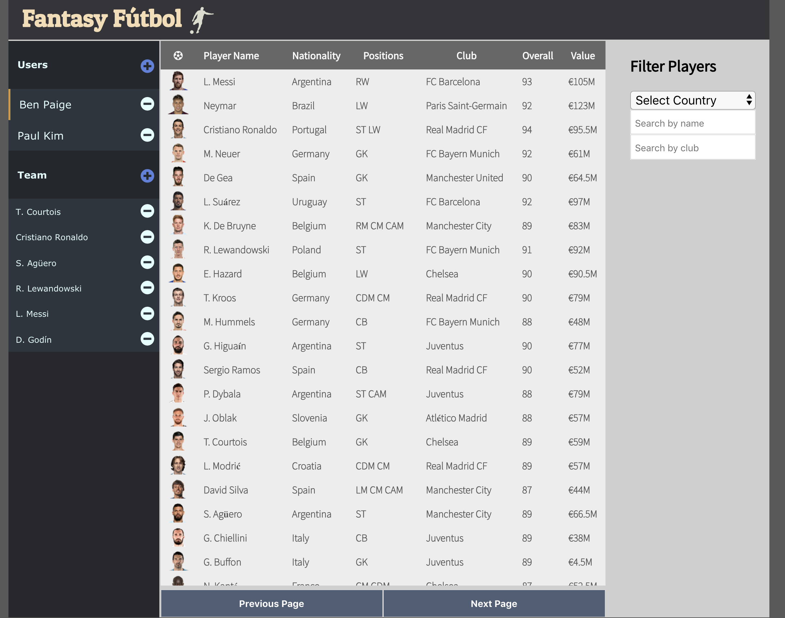
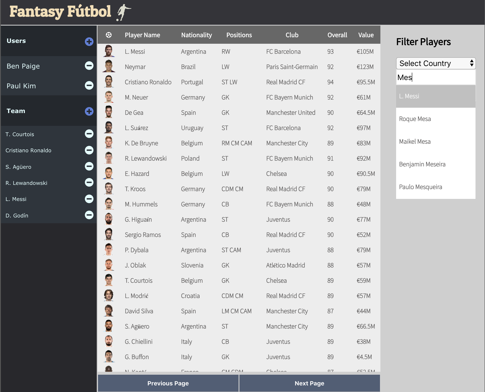
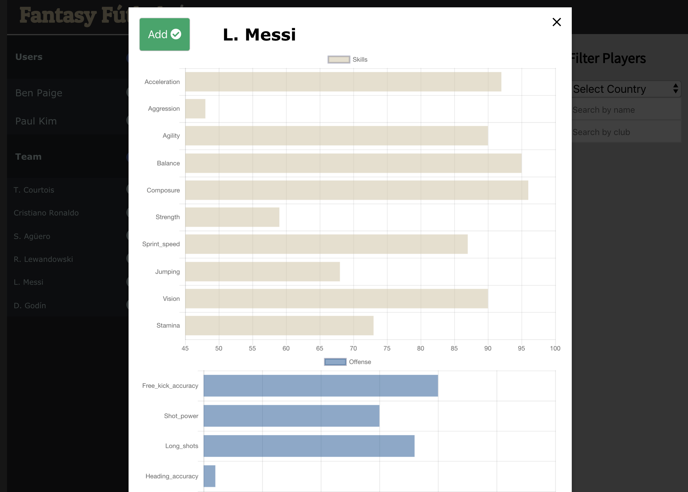

# Fantasy Futbol

Fantasy Futbol allows users to create a custom Fantasy Futbol league.  Users have the option to search for players by name, country, or club.  In addition, users can view particular stats and add/remove players to/from their team. 

- [See it Live](https://fantasy-futbol-app.herokuapp.com/user0)

## Technology

* [Node.js](https://github.com/sojurner/BYOB) 
  * Knex.js
  * Express.js
* [React](https://github.com/facebook/create-react-app).
* Redux

## Testing Suite

* Enzyme / Jest

## Set Up

- Clone down this repo

- Installing Dependencies: `npm install`

- Starting Server: `npm start`

- Running test `npm test`

## Final Result
 

  

  

## Contributors
[Benjamin Paige](https://github.com/benjaminpaige)

Data from [FiveThirtyEight](https://github.com/fivethirtyeight/data)
